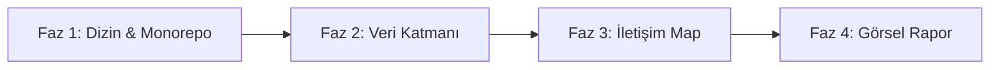

# BazarX Projesi Uçtan Uca Mimari Haritalama (Fotoğraflama) Planı
> **Tarih:** 24 Mayıs 2026  
> **Hedef:** BazarX Monorepo yapısının, veri modellerinin, servis bağımlılıklarının ve iletişim kanallarının eksiksiz bir teknik haritasını (blueprint) çıkarmak.

---

## 🗺️ 1. GİRİŞ VE HEDEFLER

BazarX, Nuxt 3 frontend, NestJS backend API, gRPC tabanlı finansal servisler, RabbitMQ event kurguları ve MongoDB/PostgreSQL veritabanlarından oluşan karmaşık bir monorepo yapısına sahiptir. Projenin "fotoğrafını çekmek" (mimari haritasını çıkarmak), teknik borçların analiz edilmesini, yeni ekip üyelerinin projeye hızlı adapte olmasını ve sistem genişleme kararlarının güvenle alınmasını sağlar.

Bu plan, projenin tamamını görselleştirmek ve dokümante etmek için izleyeceğimiz **4 adımlı metodolojiyi** tanımlar.

---

## 🛠️ 2. HARİTALAMA METODOLOJİSİ VE ARAÇLAR

Projenin teknik fotoğrafını çekmek için 3 farklı yaklaşım bir arada kullanılacaktır:

### A. Statik Kod Analizi ve Mermaid Grafları
Modüller arası ilişkileri, veri akış şemalarını ve bağımlılık zincirlerini görselleştirmek için standart **Mermaid.js** diyagramları oluşturulacaktır. Bu diyagramlar doğrudan Markdown belgeleri içinde render edilebilir.

### B. Graphify ile Bilgi Grafı (Knowledge Graph)
Projenin `.agents/workflows/graphify.md` iş akışı ve `~/.agents/skills/graphify/SKILL.md` yönergeleri kullanılarak, monorepo içindeki tüm dosyalar ve bağımlılıklar taranarak gezilebilir bir **Bilgi Grafı (Knowledge Graph)** çıktısı üretilecektir.

### C. Şema ve API Envanteri Çıkarımı
MongoDB Mongoose şemaları, PostgreSQL Prisma modelleri ve NestJS controller sınıfları taranarak tüm API ve veri katmanının metrik envanteri (Excel/Markdown tabloları halinde) toplanacaktır.

---

## 📅 3. UYGULAMA ADIMLARI (FAZLAR)

### 📂 Faz 1: Monorepo & Dizin Bağımlılık Ağacı
**Amaç:** Turbo Monorepo içindeki paketlerin ve uygulamaların birbiriyle olan bağlarını ortaya çıkarmak.

1. **Paket İlişkileri:** `packages/` (`shared-core`, `shared-persistence`, `shared-security` vb.) klasörlerinin `apps/` (`backend`, `financial-service`, `frontend`) uygulamaları tarafından nasıl import edildiğinin bağımlılık grafiği (DAG) çıkarılacaktır.
2. **Dizin Envanteri:** Projenin genel klasör yapısı (L1 ve L2 derinlikte) listelenip dokümante edilecektir.

---

### 🗄️ Faz 2: Veri Katmanının (Persistence) Fotoğraflanması
**Amaç:** Veritabanı şemalarının ve veri modellerinin ilişkisel haritasını çıkarmak.

1. **MongoDB / Mongoose Şemaları:** `packages/shared/shared-persistence/src/schemas/backend/` altındaki tüm şemalar (Surplus, TradeOffer, SwapSession, MenuPurchase vb.) taranarak alan tipleri ve indeks haritası çıkarılacaktır.
2. **PostgreSQL / Prisma Modelleri:** `apps/financial-service/` altındaki Wallet, AccountHold, Escrow, GeneralLedger gibi finansal tabloların ilişkisel şeması görselleştirilecektir.
3. **Mizan Tutarlılık Noktaları:** Double-entry bookkeeping sistemine dahil olan Debit/Credit hesap eşleşmeleri tablolaştırılacaktır.

---

### 🔄 Faz 3: İletişim ve Entegrasyon Haritası (API & Event Flow)
**Amaç:** Mikro-servislerin birbiriyle nasıl konuştuğunu (HTTP, gRPC, Event) haritalamak.

1. **HTTP REST API Envanteri:** NestJS Controller sınıfları (@Get, @Post, @Patch vb.) taranarak Swagger uyumlu uç nokta (endpoint) listesi oluşturulacaktır.
2. **gRPC Entegrasyon Noktaları:** Backend ile Financial Service arasındaki gRPC protokol tanımları (proto dosyaları) ve Gateway çağrıları (`holdFunds`, `releaseFunds` vb.) listelenecektir.
3. **RabbitMQ Event Haritası:** `@RabbitSubscribe` ve outbox event fırlatıcıları taranarak servisler arası event-driven (olay güdümlü) iletişim grafiği çizilecektir.

---

### 📊 Faz 4: Görsel Raporlama ve Çıktı Üretimi
**Amaç:** Toplanan tüm verileri anlamlı bir mimari el kitabına (Architecture Guidebook) dönüştürmek.

1. **Mermaid Diyagramlarının Çizilmesi:**
   - **L1: Sistem Bağlam Diyagramı** (Kullanıcı -> Backend API -> Services -> DB)
   - **L2: B2B Barter & GO Sipariş Akış Diyagramları**
   - **L3: Paket Bağımlılık Ağacı**
2. **Teknik Borç (Technical Debt) Tespiti:** Analiz sırasında saptanan mimari riskler (performans darboğazları, scale-out cron sorunları vb.) rapora eklenecektir.
3. **Çıktı Dosyaları:** Tüm bu görselleştirme çıktıları projenin `docs/architecture/` dizini altına kaydedilecektir.

---

## 🚀 BAŞLANGIÇ ADIMI

Bu planı onayladıktan sonra, **Faz 1** ile başlayarak Monorepo yapısının ve paket bağımlılıklarının Mermaid diyagramını oluşturup taramaya başlayabiliriz. Onayınız doğrultusunda ilk taramayı tetikleyeceğim.
