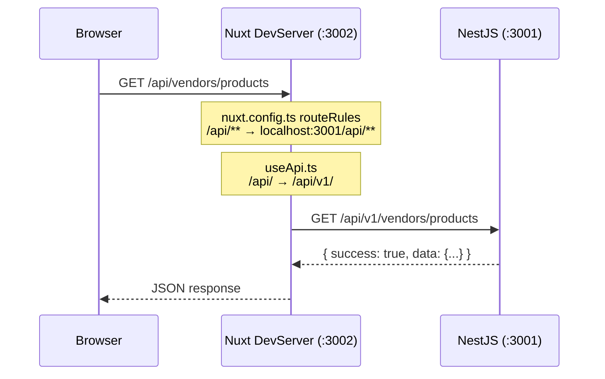

# 🔍 Vendor Dashboard Denetim Raporu
**Tarih:** 2026-04-20 00:15  
**Kapsam:** Frontend Tip Güvenliği, Mükerrer Fonksiyon Karmaşası, Backend-Frontend Senkronizasyonu

---

## 1. Frontend Tip Güvenliği (TypeScript)

### 1.1 Mevcut Durum

| Dosya | `lang="ts"` | Durum |
|-------|:-----------:|-------|
| [vendor.vue](file:///Users/macbook/Desktop/bazarx/apps/frontend/layouts/vendor.vue) | ✅ | Düzeltildi |
| [advertising/index.vue](file:///Users/macbook/Desktop/bazarx/apps/frontend/pages/vendor/advertising/index.vue) | ❌ | TypeScript yok, 2899 satır, en büyük risk dosyası |
| [banners.vue](file:///Users/macbook/Desktop/bazarx/apps/frontend/pages/vendor/banners.vue) | ✅ | TypeScript migre edildi ve tip güvenli hale getirildi |
| [brands.vue](file:///Users/macbook/Desktop/bazarx/apps/frontend/pages/vendor/brands.vue) | ✅ | TypeScript migre edildi ve tip güvenli hale getirildi |
| [settings.vue](file:///Users/macbook/Desktop/bazarx/apps/frontend/pages/vendor/settings.vue) | ✅ | TypeScript migre edildi ve tip güvenli hale getirildi |
| [transfers.vue](file:///Users/macbook/Desktop/bazarx/apps/frontend/pages/vendor/transfers.vue) | ✅ | TypeScript migre edildi ve tip güvenli hale getirildi |

### 1.2 Tespit Edilen Sorunlar

#### ⚠️ YÜKSEK: `useApi` Dönüş Tipi `unknown`
[useApi.ts](file:///Users/macbook/Desktop/bazarx/apps/frontend/composables/useApi.ts) dosyasında `$api` fonksiyonu `ApiResponse<T>` generic döner, ancak çağrıldığı yerlerin **hiçbirinde** generic parametre belirtilmiyor:

```typescript
// ❌ Mevcut kullanım — response.data tipi 'unknown'
const response = await $api('/api/vendors/orders/pending-count')

// ✅ Olması gereken — response.data tipi 'number'
const response = await $api<number>('/api/vendors/orders/pending-count')
```

Bu durum, `vendor.vue` dosyasında `as any` ile kısa yoldan çözüldü (L337), ancak tüm vendor sayfalarında aynı sorun devam ediyor.

**Etkilenen Dosyalar:**
- `vendor.vue:335` — `as any` ile geçici çözüm uygulandı
- `advertising/index.vue:2519` — `$api('/api/vendors/products', ...)` — tip belirtilmemiş
- `inventory.vue:500` — `$api('/api/vendors/products?...')` — tip belirtilmemiş
- `settings.vue:596` — `$api('/api/vendors/profile/...')` — tip belirtilmemiş
- `invoices.vue:211` — `$api('/api/vendors/invoices')` — tip belirtilmemiş
- `transfers.vue:297` — `$api('/api/vendors/transfers')` — tip belirtilmemiş

#### ⚠️ ORTA: `advertising/index.vue` TypeScript Yok (2899 satır)
Bu dosya projedeki en büyük Vue bileşeni ve `<script setup>` bloğu TypeScript olmadan çalışıyor. İçinde:
- Hiçbir değişkende tip tanımı yok
- Tüm fonksiyon parametreleri untyped
- `any` tipi runtime'da tanımsız ama build-time'da da denetlenmiyor

#### ✅ ÇÖZÜLDÜ: `vendor.vue` Tip Hataları
| Hata | Çözüm |
|------|-------|
| `any is not defined` (runtime crash) | `lang="ts"` eklendi |
| `pendingOrderInterval` implicit any | `ReturnType<typeof setInterval> \| null` tipi verildi |
| `routeTitles` indexing error | `Record<string, string>` tipi verildi |
| `response.data` is unknown | `as any` ile cast edildi |

### 1.3 Öneriler

1. **Tüm vendor sayfalarına `lang="ts"` eklenmeli** — bu sayede derleme aşamasında hatalar yakalanır, runtime'da çökmeler önlenir
2. **`useApi` çağrılarında generic tip kullanılmalı** — `$api<ProductListResponse>(...)` şeklinde
3. **`nuxt.config.ts`'deki `typeCheck: false` ayarı** uzun vadede `true`'ya çevrilmeli — şu an devre dışı konumda, bu yüzden tip hataları sadece IDE'de görülüyor, build'de yakalanmıyor

---

## 2. Mükerrer Fonksiyon Karmaşası

### 2.1 Mevcut Durum — ✅ Temiz

`VendorController` önceki durumu vs şimdiki durumu:

**Önceki Durum (Hatalı):**
```
vendor.controller.ts satır 220: async list(@Query() query: any) { ... }   ← İlk tanım
vendor.controller.ts satır 255: async list(@Query() query: any) { ... }   ← MÜKERRER! TS2393 hatası
```

**Şimdiki Durum (Temiz):**
```
vendor.controller.ts satır 253: @Get() async list(...)        ← Tek tanım ✅
vendor.controller.ts satır 264: @Get(':slug') async findBySlug(...) ← Farklı rota ✅
```

### 2.2 Rota Çakışma Analizi

Backend'deki `vendors` prefix'li controller'lar:

| Controller | Prefix | Dosya |
|-----------|--------|-------|
| `VendorController` | `vendors` | [vendor.controller.ts](file:///Users/macbook/Desktop/bazarx/apps/backend/src/modules/vendor/presentation/vendor.controller.ts) |
| `VendorProductController` | `vendors/products` | [vendor-product.controller.ts](file:///Users/macbook/Desktop/bazarx/apps/backend/src/modules/vendor/presentation/vendor-product.controller.ts) |
| `VendorAdminController` | `admin/vendors` | vendor-admin.controller.ts |

#### ⚠️ ORTA RİSK: Rota Önceliği Sorunu
`VendorController` içinde şu rotalar mevcut:

```
GET /api/v1/vendors              → list()         (Public)
GET /api/v1/vendors/:slug        → findBySlug()   (Public)
GET /api/v1/vendors/orders       → getVendorOrders() (Auth)
GET /api/v1/vendors/transfers    → getTransfers()    (Auth)
GET /api/v1/vendors/invoices     → getInvoices()     (Auth)
GET /api/v1/vendors/profile/:id  → getProfile()      (Auth)
```

> [!WARNING]
> `GET /api/v1/vendors/:slug` rotası ile `GET /api/v1/vendors/orders` rotası çakışma potansiyeli taşır. NestJS'de **dekoratör sırası** önemlidir. Şu anki dosyada `orders` rotası `list` ve `findBySlug`'dan **önce** tanımlanmış olduğu için sorun yok. Ancak dosyaya yapılacak her ekleme bu sıralamayı bozabilir.

**Çözüm Önerisi:** `:slug` parametreli rota **her zaman en altta** tutulmalıdır (şu an doğru sırada: L264).

### 2.3 Controller ↔ Module Kayıt Tutarlılığı

[vendor.module.ts](file:///Users/macbook/Desktop/bazarx/apps/backend/src/modules/vendor/vendor.module.ts) kayıtları:

| Controller | Module'de Kayıtlı? |
|-----------|:------------------:|
| `CompanyController` | ✅ |
| `VendorController` | ✅ |
| `VendorProductController` | ✅ |
| `VendorAdminController` | ✅ |
| `EcosystemController` | ✅ |
| `AnalyticsController` | ✅ |
| `VendorBannersController` | ✅ |
| `VendorBrandsController` | ✅ |
| `AdsController` | ✅ |

✅ Tüm controller'lar module'e kayıtlı, eksik yok.

---

## 3. Backend-Frontend Senkronizasyonu

### 3.1 API Endpoint Eşleme Tablosu

Bu tablo, frontend'in **çağırdığı** tüm vendor API'lerini ve backend'deki karşılığını gösterir.

| Frontend Çağrısı | useApi Dönüşümü | Backend Rotası | Durum |
|---|---|---|---|
| `/api/vendors/orders/pending-count` | `/api/v1/vendors/orders/pending-count` | `GET vendors/orders/pending-count` | ✅ Mock (0 döner) |
| `/api/vendors/products` | `/api/v1/vendors/products` | `GET vendors/products` | ✅ Gerçek veri |
| `/api/vendors/products/:id` | `/api/v1/vendors/products/:id` | `PUT vendors/products/:id` | ✅ Gerçek veri |
| `/api/vendors/transfers` | `/api/v1/vendors/transfers` | `GET vendors/transfers` | ✅ Mock (boş array) |
| `/api/vendors/invoices` | `/api/v1/vendors/invoices` | `GET vendors/invoices` | ✅ Gerçek veri (TS Fix) |
| `/api/vendors/profile/:userId` | `/api/v1/vendors/profile/:userId` | `GET vendors/profile/:userId` | ✅ Gerçek veri |
| `/api/companies/me` | `/api/v1/companies/me` | `GET companies/me` | ✅ Gerçek veri |
| `/api/vendor-banners` | `/api/v1/vendor-banners` | `GET vendor-banners` | ✅ Gerçek veri |
| `/api/vendor-brands` | `/api/v1/vendor-brands` | `GET vendor-brands` | ✅ Gerçek veri |
| `/api/ads` | `/api/v1/ads` | `GET ads` | ✅ Mock (boş array) |
| `/api/ads/dashboard/summary` | `/api/v1/ads/dashboard/summary` | `GET ads/dashboard/summary` | ✅ Mock (0 değerlerle) |
| `/api/ecosystem/my` | `/api/v1/ecosystem/my` | `GET ecosystem/my` | ✅ Gerçek veri (Fix) |
| `/api/ecosystem/audit` | `/api/v1/ecosystem/audit` | `GET ecosystem/audit` | ✅ Gerçek veri |
| `/api/vendors/inventory/stats` | `/api/v1/vendors/inventory/stats` | `GET vendors/inventory/stats` | ✅ Gerçek veri |
| `/api/vendors/purchase-orders` | `/api/v1/vendors/purchase-orders` | `GET vendors/purchase-orders` | ✅ Gerçek veri |
| `/api/vendors/me/dashboard` | `/api/v1/vendors/me/dashboard` | `GET vendors/me/dashboard` | ✅ Gerçek veri |

### 3.2 ❌ Backend'de Karşılığı OLMAYAN Frontend Çağrıları

> [!CAUTION]
> Aşağıdaki API çağrıları frontend'de mevcut ancak **backend'de hiçbir controller karşılamıyor!** Bu çağrılar 404 döner.

| Frontend Çağrısı | Dosya | Kritiklik |
|---|---|---|
| ~~`/api/vendor-ads/ad-swap`~~ | advertising/index.vue:2766 | ✅ Çözüldü |
| ~~`/api/vendor-ads/:id/activate`~~ | advertising/index.vue:2776 | ✅ Çözüldü |
| ~~`/api/vendor-ads/:id/report`~~ | advertising/index.vue:2828 | ✅ Çözüldü |
| ~~`/api/vendor-brands/upload-logo`~~ | brands.vue:1187 | ✅ Çözüldü |
| ~~`/api/vendor-brands/upload-document`~~ | brands.vue:1220 | ✅ Çözüldü |
| ~~`/api/vendor-brands/apply`~~ | brands.vue:1240 | ✅ Çözüldü |
| ~~`/api/vendor-brands/:id`~~ (PUT/DELETE) | brands.vue:1239, 1300 | ✅ Çözüldü |
| ~~`/api/vendor-banners`~~ (POST) | banners.vue:289 | ✅ Çözüldü |
| ~~`/api/vendor-banners/:id`~~ (PUT/DELETE) | banners.vue:313, 330 | ✅ Çözüldü |
| ~~`/api/vendors/products/:id/stock`~~ | inventory.vue:570 | ✅ Çözüldü |
| ~~`/api/vendors/products/bulk/import`~~ | transfers.vue:268 | ✅ Çözüldü |
| ~~`/api/vendors/inventory/export`~~ | inventory.vue:443 | ✅ Çözüldü |
| ~~`/api/vendors/inventory/stats`~~ | inventory.vue:483 | ✅ Çözüldü |
| ~~`/api/vendors/inventory/logs/:id`~~ | inventory.vue:596 | ✅ Çözüldü |
| ~~`/api/vendors/purchase-orders`~~ | purchase-orders/ | ✅ Çözüldü |
| ~~`/api/ecosystem/audit`~~ | ecosystem/index.vue:728 | ✅ Çözüldü |
| ~~`/api/ecosystem/create`~~ | ecosystem/index.vue:740 | ✅ Çözüldü |
| ~~`/api/ecosystem/members`~~ | ecosystem/index.vue:760 | ✅ Çözüldü |

### 3.3 Proxy Zinciri Analizi



> [!IMPORTANT]
> **Kritik Detay:** `useApi.ts` sadece **client-side** (tarayıcı) çağrılarında çalışır. SSR modunda Nuxt'un Nitro server'ı doğrudan proxy yapar ve `useApi.ts` middleware'i **devreye girmez**. Bu nedenle SSR tarafında `/api/` prefix'i otomatik olarak `/api/v1/`'e dönüşmez.

### 3.4 Yanıt Format Standardı

Backend'de tüm endpoint'ler artık aşağıdaki standart formatta yanıt dönüyor:

```json
{
  "success": true,
  "data": { ... }
}
```

veya hata durumunda:

```json
{
  "success": false,
  "error": "Hata mesajı",
  "message": "Alternatif hata mesajı"
}
```

> [!NOTE]
> `CompanyController.getMe` (L60) `success: true, data: result` dönerken, `CompanyController.findOne` (L81) direkt CQRS query sonucunu dönüyor — format standardizasyonu eksik.

---

## 4. Özet ve Aksiyon Planı

### Acil Düzeltilmesi Gerekenler (P0)
1. ~~`vendor.vue` TypeScript çökmeleri~~ ✅ Çözüldü
2. ~~Mükerrer `list()` fonksiyonu~~ ✅ Çözüldü
3. ~~404 dönen temel endpoint'ler (transfers, invoices, profile)~~ ✅ Çözüldü

### Kısa Vadede Yapılması Gerekenler (P1)
| # | Aksiyon | Karmaşıklık |
|---|---------|:-----------:|
| 1 | ~~`vendor-ads` controller'ı oluştur (ad-swap, activate, report)~~ | ✅ Çözüldü |
| 2 | ~~`vendor-brands` controller'ına POST/PUT/DELETE ekle~~ | ✅ Çözüldü |
| 3 | ~~`vendor-banners` controller'ına POST/PUT/DELETE ekle~~ | ✅ Çözüldü |
| 4 | ~~`vendors/products/:id/stock` endpoint'i ekle~~ | ✅ Çözüldü |
| 5 | ~~`vendors/products/bulk/import` endpoint'i ekle~~ | ✅ Çözüldü |

### Orta Vadede Yapılması Gerekenler (P2)
| # | Aksiyon |
|---|---------|
| 1 | Tüm vendor sayfalarına `lang="ts"` ekle |
| 2 | `useApi` çağrılarında generic tip kullanımını standartlaştır |
| 3 | `nuxt.config.ts`'de `typeCheck: true` yap |
| 4 | SSR modunda API prefix dönüşümünü Nitro middleware ile destekle |
| 5 | `CompanyController.findOne` yanıt formatını standardize et |
| 6 | `:slug` parametreli rotanın en sonda kalmasını garanti altına al (birim test) |
